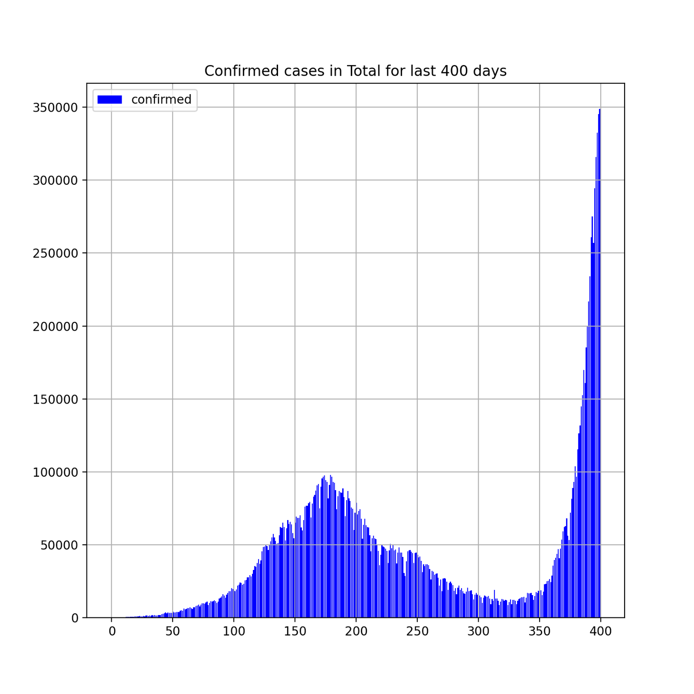
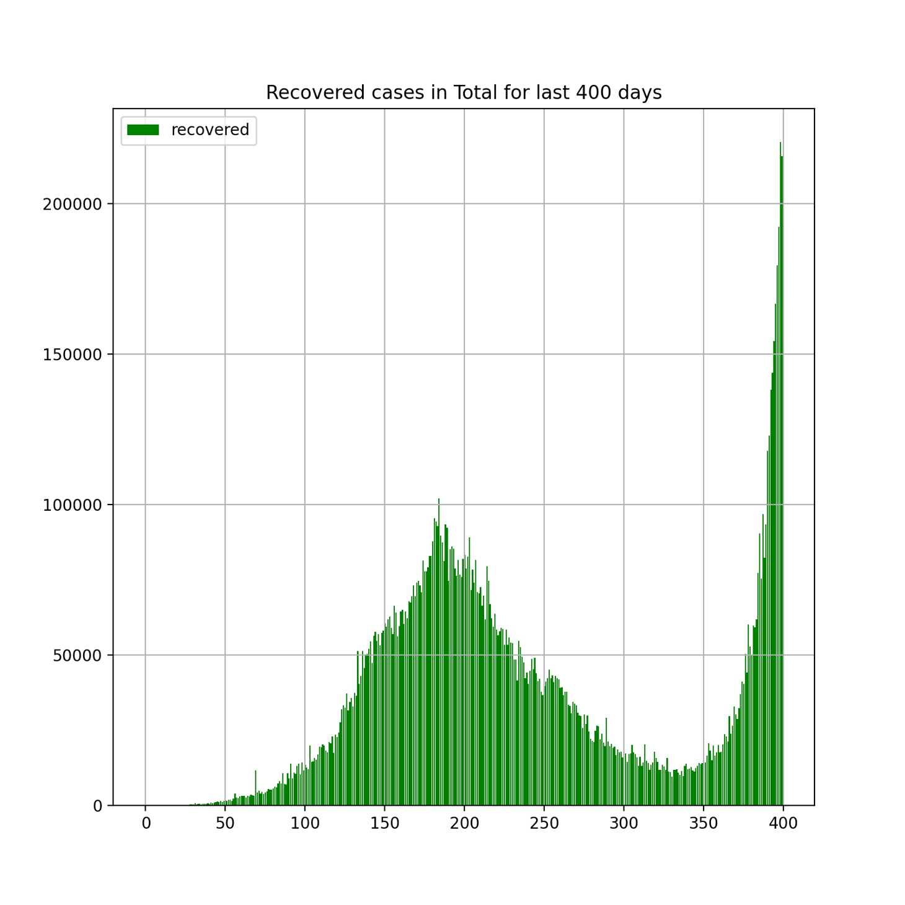
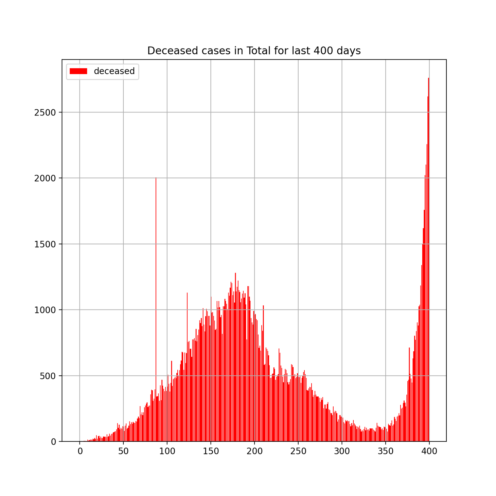
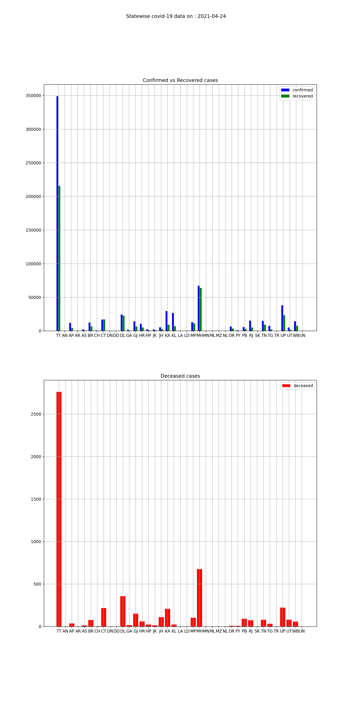
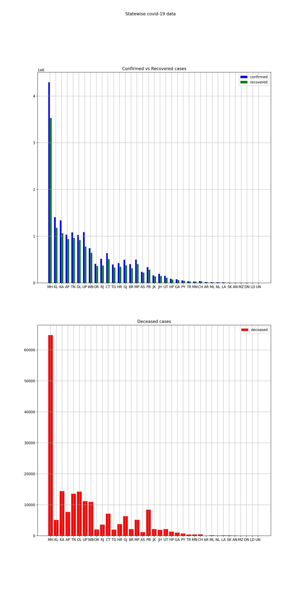
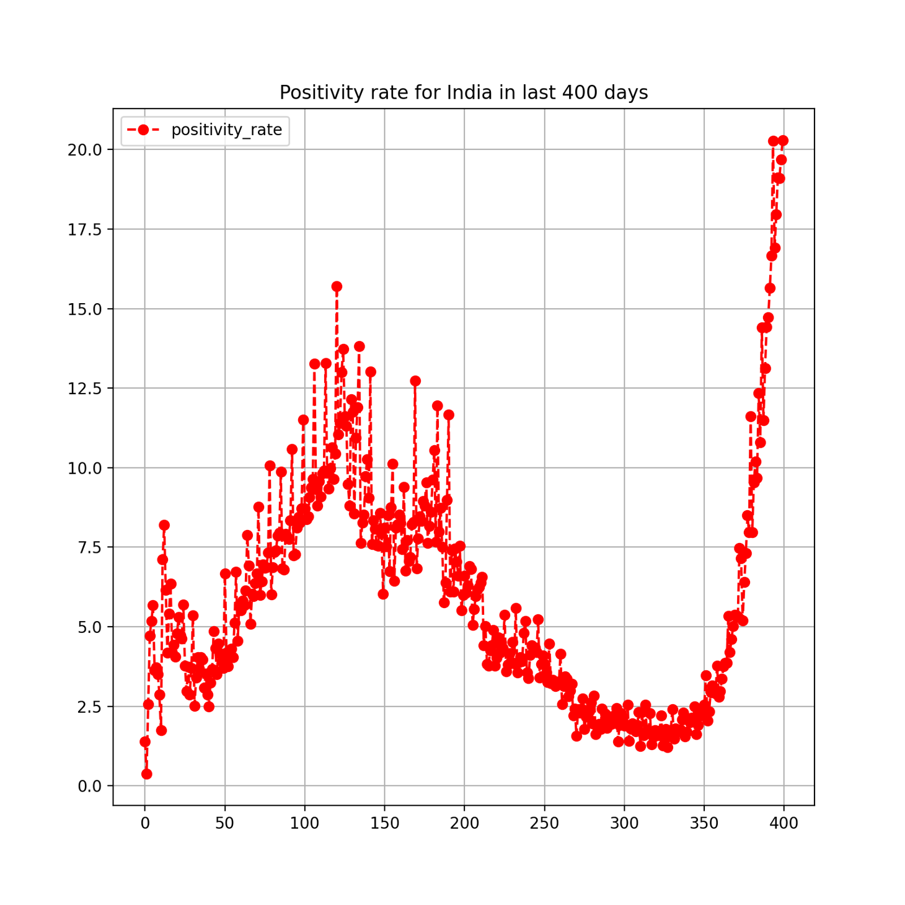
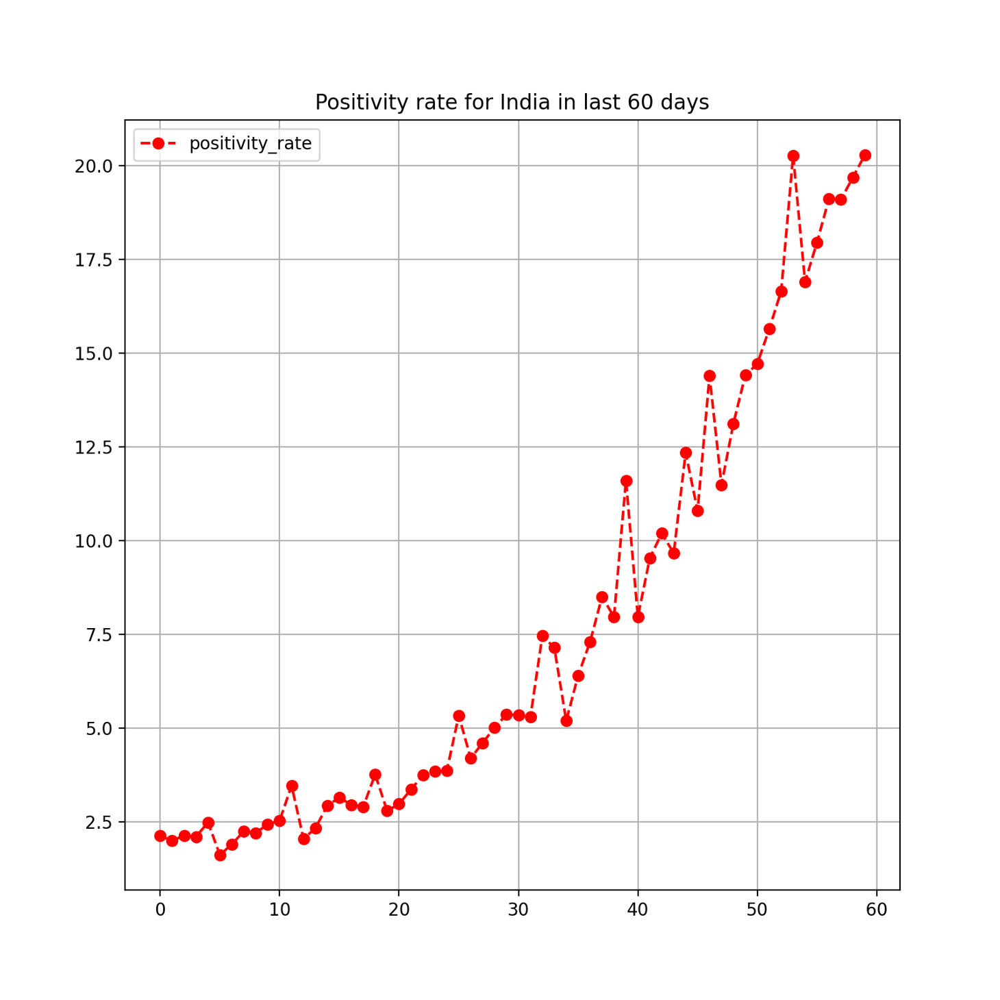
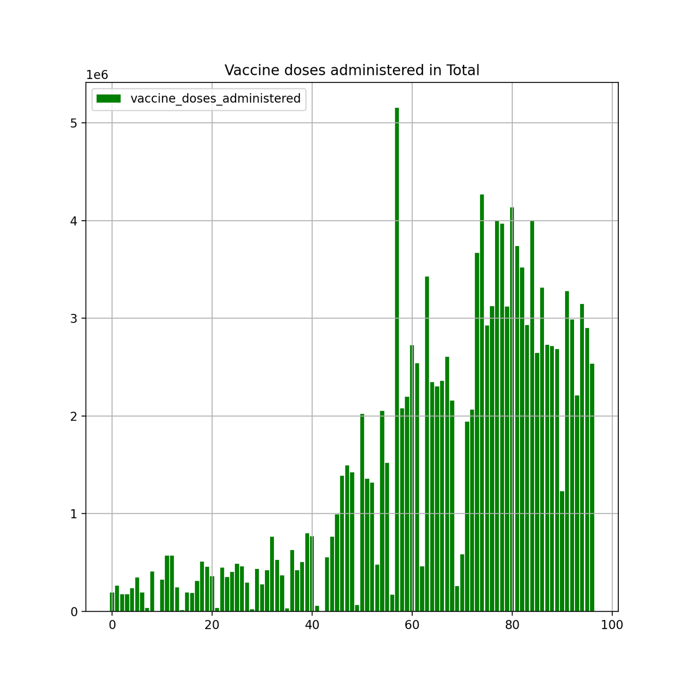
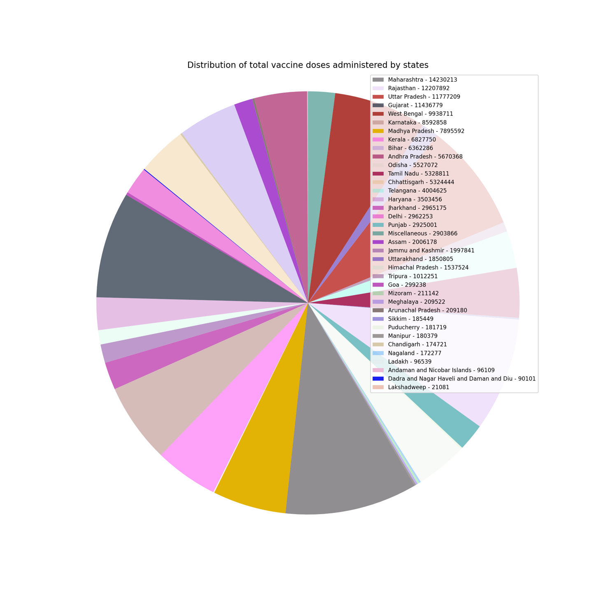

# Visualizer for analysis of reported covid-19 data for India

* The visualizer is for analysis of reported covid-19 data for India
* The source of data is [https://www.covid19india.org/](https://www.covid19india.org/)
* The csv data can be found in [https://api.covid19india.org/documentation/csv/](https://api.covid19india.org/documentation/csv/)

# Requirements
* streamlit

# Sample plots and app screenshots

